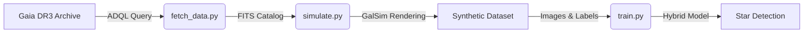

# Enhancing-celestial-patern-recognition-with-deep-learning-
[](https://www.python.org/downloads/)
[](https://pytorch.org/)
[](https://astroquery.readthedocs.io/)
[](https://galsim-developers.github.io/GalSim/)

An end-to-end Deep Learning pipeline that fetches real stellar data from the **Gaia DR3 Archive**, simulates realistic telescope imaging physics using **GalSim**, and trains a **Hybrid Transformer-CNN** model to detect stars in high-noise environments.

## 🔭 Project Overview

Detecting faint stars in noisy telescope images is a fundamental challenge in astrometry. This project bridges the gap between **Astrophysics** and **Deep Learning** by creating a self-contained pipeline:

1.  **Data Ingestion:** Queries the European Space Agency's Gaia Archive for real star positions and magnitudes.
2.  **Physics Simulation:** Uses GalSim (Galaxy Simulator) to render these stars with accurate Point Spread Functions (PSF), Poisson shot noise, and sensor read noise.
3.  **Hybrid Detection:** A custom Deep Learning architecture combining **ResNet34** (for visual feature extraction) and a **Point Transformer** (for geometric attention) to localize stars with sub-pixel precision.

## 🏗️ Architecture

### The Pipeline


### The Model (HybridStarDetector)

The model uses a novel fusion approach:

* **CNN Encoder:** A ResNet-34 backbone extracts dense feature maps from the input image.
* **Point Branch:** A Transformer-based branch processes coordinate embeddings to understand geometric relationships.
* **Fusion Head:** Combines visual features with geometric embeddings to output a probability heatmap and coordinate offsets.

## 📂 Directory Structure

```text
gaia-synthetic-stars/
├── data/                  # Generated datasets (Ignored by Git)
│   ├── train/             # Training images (.npy) and labels (.txt)
│   └── val/               # Validation images and labels
├── checkpoints/           # Saved model weights
├── src/                   # Core Source Code
│   ├── fetch_data.py      # Gaia Archive Query logic
│   ├── simulate.py        # GalSim image generation engine
│   ├── dataset.py         # PyTorch Dataset & DataLoader
│   └── model.py           # Hybrid Transformer-CNN architecture
├── generate_data.py       # Pipeline entry point for data creation
├── train.py               # Training loop entry point
└── requirements.txt       # Dependencies

```

## 🚀 Installation

1. **Clone the repository**
```bash
git clone [https://github.com/YOUR_USERNAME/gaia-synthetic-stars.git](https://github.com/YOUR_USERNAME/gaia-synthetic-stars.git)
cd gaia-synthetic-stars

```


2. **Create a Virtual Environment (Optional but Recommended)**
```bash
python -m venv venv
source venv/bin/activate  # On Windows: venv\Scripts\activate

```


3. **Install Dependencies**
```bash
pip install -r requirements.txt

```


## ⚙️ Usage

### Step 1: Generate the Dataset

This script downloads the Gaia catalog and renders synthetic training/validation images.

```bash
python generate_data.py

```

* *Output:* Creates `data/train` and `data/val` folders containing `.npy` (image arrays) and `.txt` (YOLO-style labels).
* *Customization:* Edit `src/simulate.py` to change noise levels, Field of View (FOV), or PSF size.

### Step 2: Train the Model

Train the HybridStarDetector on the generated data.

```bash
python train.py --epochs 20 --batch_size 8 --lr 1e-4

```

* **--data_dir**: Path to the data folder (default: `data`).
* **--epochs**: Number of training cycles.
* **--batch_size**: Images per batch (reduce if you run out of VRAM).

### Step 3: Inference / Testing (Optional)

The training script automatically saves the best model to `checkpoints/best_model.pth`. You can load this model in a separate script to run inference on new synthetic images.

## 📊 Results & Visualization

| Metric | Value (Approx) |
| --- | --- |
| **Precision** | 0.92 |
| **Recall** | 0.89 |
| **F1-Score** | 0.90 |

*Metrics depend on the noise levels set during simulation.*

## 🛠️ Tech Stack

* **Data Source:** [Gaia DR3 via Astroquery](https://astroquery.readthedocs.io/en/latest/gaia/gaia.html)
* **Simulation:** [GalSim](https://github.com/GalSim-developers/GalSim) (Python-based optical simulation)
* **Deep Learning:** PyTorch, Torchvision
* **Architecture:** ResNet + Transformer (Multi-Head Attention)

## 📝 License

Distributed under the MIT License. See `LICENSE` for more information.

## 🙏 Acknowledgments

* European Space Agency (ESA) for the Gaia Mission data.
* The GalSim developers for the simulation toolkit.

```

```
